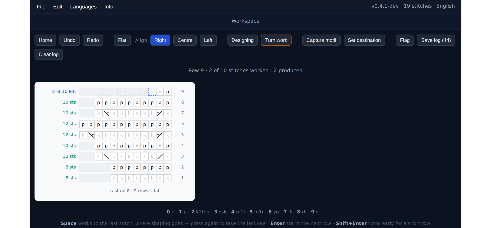

# KnitGrid

A knitting chart editor where the shape comes from the stitches.

You cast on, type a row, and the next row is worked out from what that row
produced. Increases widen the chart, decreases narrow it. Nothing is drawn in
advance — the outline of the piece is a consequence of the knitting, the same
way it is on the needles.



**Status: early development (v0.4).** It is usable for charting. Several things
listed under [Not done yet](#not-done-yet) are missing.

## Why

Most chart tools hand you a fixed grid and let you draw symbols on it. The
symbols do not mean anything to the tool, so it cannot tell you that a row does
not close, or that a decrease has nothing left to eat.

KnitGrid stores what each stitch actually does: how many live stitches it takes
from the row below, and how many it hands to the row above. Two integers per
stitch turn out to be enough to derive the width of every row, to catch a row
whose arithmetic does not work, and to know where a short row turned.

## Running it

Requires Node 20 or newer.

```bash
npm install
npm run dev
```

Then open the URL it prints. `npm run build` produces a static site in `dist/`.

## Charting

**New pattern** asks for a cast-on between 6 and 128 stitches, whether the piece
is worked flat or in the round, and optional notes for gauge, yarn and sizing.

The chart reads the way knitting does: bottom to top, right to left. Rows are
entered from the number row or the numpad.

| key | stitch | | key | stitch |
|---|---|---|---|---|
| `0` | knit | | `5` | make one right |
| `1` | purl | | `6` | yarn over |
| `2` | knit two together | | `7` | left lifted increase |
| `3` | slip slip knit | | `8` | right lifted increase |
| `4` | make one left | | `9` | slip |

Each row shows how many stitches it still owes, and how many it produced once
it closes. A row stays current until you leave it, the way the work stays on the
needle until you turn it.

- **Space** works to the last stitch, repeating whatever the row is already
  working, so a purl row fills with purls. It stops one short because that is
  where shaping goes; pressing it again takes the last stitch. So a plain row is
  Space, Space, Enter, and the standard edge increase

  ```
  k1, m1r, knit to last stitch, m1l, k1
  ```

  is `0` `5` Space `4` `0` Enter — six keystrokes at any width.
- **Enter** starts the next row. On a finished row an increase simply appends,
  because the row has not gone anywhere; a stitch that needs a live stitch rolls
  onto the next row by itself, since there is nothing here for it to eat.
- **Turn work** ends a row early, making it a short row. Pressing Enter on an
  unfinished row is refused, because turning reshapes everything above it and
  should not fall out of a stray keystroke.
- A stitch that would consume more than the row has left is refused, with the
  option to place it anyway. The row is then flagged as not closing.
- **Designing / Knitting** switches between the chart as designed and the chart
  as worked. In Knitting mode on a flat piece, wrong-side rows reverse direction
  and show the stitch you actually work, so a charted knit shows as a purl.

## The stitch table

`src/features/stitches/stitches.json` is the whole domain model:

```json
{ "id": "k2tog", "abbr": "k2tog", "name": "knit two together",
  "consumes": 2, "produces": 1, "category": "decrease",
  "lean": "right", "wsCounterpart": "p2tog" }
```

It is data rather than code so that other tools can read the same table instead
of reimplementing it. `lean` drives the drawn glyph — the stroke slants the way
the stitch leans, with a plus for increases and a minus for decreases.

Entries without a `wsCounterpart` are unresearched, not symmetric by default;
not every stitch has an opposite. The `pending` section lists stitches the table
needs to grow to hold, and what each one needs from the schema first — the
double stitch is the notable one, since it carries state across rows and so
cannot be described by two integers.

## Session logs

Under `npm run dev`, the workspace records every action and the state of the
chart after it, including actions that were refused. **Flag** annotates the
moment something looks wrong; **Save log** writes it to `logs/`. The dev server
does the writing, since a page cannot choose where a file goes.

## Not done yet

The fuller list, with reasoning, is in [TODO.md](TODO.md).

- Motif tiling is stubbed. Repeating a motif that changes a row's stitch count
  changes every row above it, and which repair to apply is the knitter's call,
  so it waits on a dialog that offers the choice.
- Stitches are drawn in square cells. The intended rendering draws each stitch
  as a shape spanning what it consumes at the bottom and what it produces at the
  top, so decreases visibly converge and increases fan out.
- Double stitch and German short rows.
- Saved projects are files on disk; there is no library listing them.
- Settings is a placeholder. The number palette is the obvious thing to make
  configurable there.
- No test suite. The row arithmetic in `src/features/project/rowMath.ts` and the
  project file parser are where one would pay for itself first.

## Demo

The build is a static site, deployed to GitHub Pages by
[.github/workflows/deploy.yml](.github/workflows/deploy.yml) on every push to
`main`. Enable it once under **Settings → Pages → Source → GitHub Actions**.

## Licence

MIT — see [LICENSE](LICENSE).
